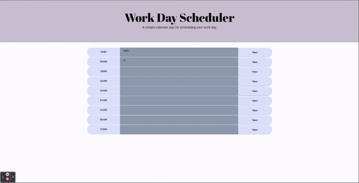

# True Crime Multiple Choice Quiz

A fully responsive, Day Planner.

#### You can view the deployed app by [clicking here!](https://fudge88.github.io/day-planner-app/)

## Summary

This planner is dynamically created using JQuery, and also runs on Live time. The purpose of this app is to store notes and appointments in Local Storage, against the hour of the appointment. This app is made accessible by colour coding the past, present and future using hours.



## User Story

```md
AS AN employee with a busy schedule
I WANT to add important events to a daily planner
SO THAT I can manage my time effectively
```

## Acceptance Criteria

```md
GIVEN I am using a daily planner to create a schedule
WHEN I open the planner
THEN the current day is displayed at the top of the calendar
WHEN I scroll down
THEN I am presented with timeblocks for standard business hours
WHEN I view the timeblocks for that day
THEN each timeblock is color coded to indicate whether it is in the past, present, or future
WHEN I click into a timeblock
THEN I can enter an event
WHEN I click the save button for that timeblock
THEN the text for that event is saved in local storage
WHEN I refresh the page
THEN the saved events persist
```

## Tools Used:

- Flexbox
- Bootstrap
- Media queries
- Font awesome
- Google fonts

#### Languages:

- HTML
- CSS
- JavaScript
- JQuery

#### JQuery:

JQuery's syntax is designed to make it easier to navigate a document, select DOM elements, handle events, and develop applications. JQuery has a large library built upon JavaScript. The modular approach to the jQuery library allows the creation of powerful dynamic web pages and Web applications. For example rather the creating element by element, assigning attributes to each, as you would with JavaScript. JQuery allows direct HTML code to be pasted into the `script` file using 'back-ticks'. JQuery also allows 'template-string' that dynamically changes each iteration of a repeated code using a simple 'string'.

[Flexbox positioning](https://developer.mozilla.org/en-US/docs/Web/CSS/CSS_Flexible_Box_Layout/Aligning_Items_in_a_Flex_Container)

[Mozilla.org](https://developer.mozilla.org/en-US/docs/)

[StackOverflow](https://stackoverflow.com/questions/)

## License

This project is licensed under the terms of the MIT license.

